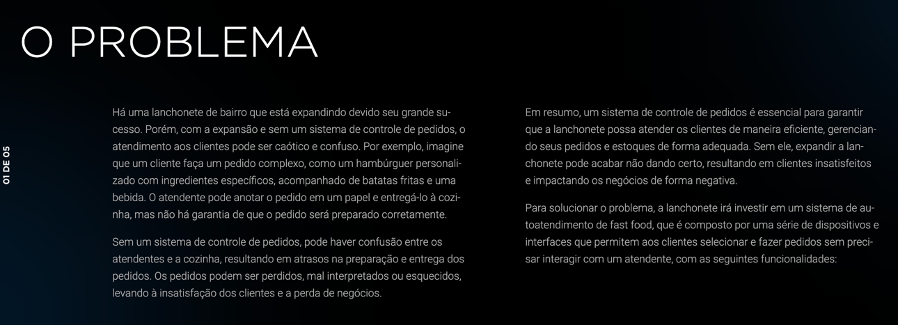
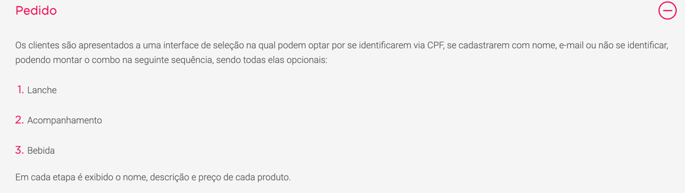
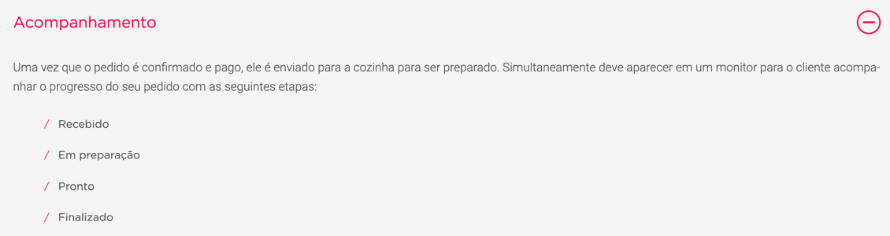
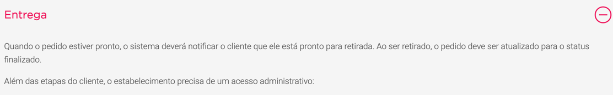
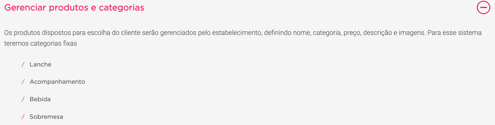
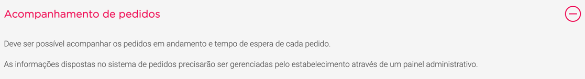
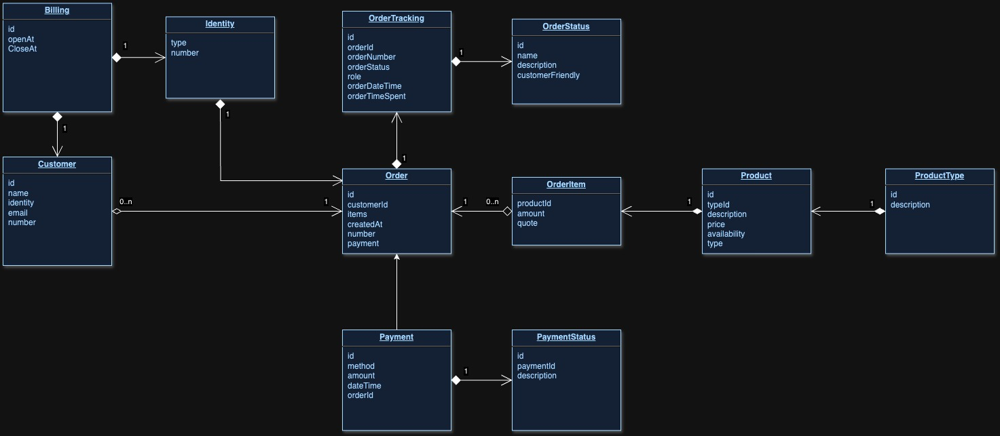

# fiap-fastfood




# Entregáveis








# Recursos e Bibliotecas
- [x] Gradle 8.3
- [x] Docker
- [x] Java 17
- [x] Mongo
- [x] Spring Boot
- [x] MapStruct
- [x] Vavr
- [x] JsonPatch
- [x] Miro (DDD) - Link: https://miro.com/app/board/uXjVMjm7RWw=/?share_link_id=111499527949
- [x] Minikube 


# Dicionário de Linguagem Ubíqua

Termos utilizados na implementação (Presentes em Código)

- **Cliente/Customer**: O consumidor que realiza um pedido no restaurante.
- **Pedido/Order**: A lista de produtos (seja uma bebida, lanche, acompanhamento e/ou sobremesa) realizada pelo cliente no restaurante.
- **Produto/Product**: Item que será consumido pelo cliente, que se enquadra dentro de uma categoria, como por exemplo: bebida, lanche, acompanhamento e/ou sobremesa.
- **Categoria/Product Type**: Como os produtos são dispostos e gerenciados pelo estabelecimento: bebidas, lanches, acompanhamentos e/ou sobremesas.
- **Esteira de Pedidos/Order Tracking**: Responsável pelo andamento e monitoramento do estado do pedido.
- **Funcionário/Employee**: Funcionário do estabelecimento.
- **Ponto de Venda/Salespoint**: Local de venda do produto, responsável pelo atendimento e entrega dos pedidos.

# Detalhes da Implementação MVP 1

## [Gerenciamento de produtos](src%2Fmain%2Fjava%2Fio%2Ffiap%2Ffastfood%2Fdriver%2Fcontroller%2Fproduct%2FProductController.java)
A aplicação dispõe de operações que permitem a inserção, edição, listagem(paginada) e a remoção de produtos. Em detalhe a possibilidade de se filtar produtos por categoria ao listar os mesmos.
Não há controle de estoque implementado na versão atual da aplicação.

### Mapeamento da entidade
    id : Identificador do produto, gerado automaticamente pela base de dados
    id da categoria : Identificador da categoria do produto
    descricao : Descrição do produto
    categoria : { 
        id da categoria : Identificador da categoria do produto
        descricao : Descrição da categoria
    }

## [Gerenciamento de Clientes](src%2Fmain%2Fjava%2Fio%2Ffiap%2Ffastfood%2Fdriver%2Fcontroller%2Fcustomer%2FCustomerController.java)
A aplicação dispõe de operações que permitem a inserção, edição, listagem(paginada) e a remoção de clientes.

### Mapeamento da entidade
    id : Identificador do produto, gerado automaticamente pela base de dados
    nome : Identificador da categoria do produto
    identidade :  {
        tipo : Tipo do documento, comumente RG ou CPF porém não há limitação de valores.
        numero : Número do documento
    }
    email : Email do cliente
    telefone : Telefone do Cliente

## [Faturamento](src%2Fmain%2Fjava%2Fio%2Ffiap%2Ffastfood%2Fdriver%2Fcontroller%2Fbilling%2FBillingController.java)
Trata-se de esboço de um possível controle de faturamento, porém nesta versão se limita a controlar os números de pedidos que são informados ao cliente.
Dispõe de duas operações, abertura e fechamento de dia. 
Ao abrir inicia-se do zero a contagem de pedidos diária, ao fechar apenas se marca o dia em questão como finalizado.

### Mapeamento da entidade
    id : Identificador único da base de dados
    data e hora de abertura : Data e hora em que se abriu o dia de faturamento 
    data e hora de fechamento : Data e hora em que se fechou o dia de faturamento

## Contador de pedidos
Durante a descoberta do produto identificamos a necessidade de se ter um número de pedido de fácil compreensão ao cliente. 
Desta forma, implementamos uma sequence que é reiniciada na abertura de um novo dia de faturamento.

### Mapeamento da entidade
    id : Identificador único da base de dados
    nome : Nome da sequência
    sequência : Valor atual da sequência

## [Pedido e Pagamento](src%2Fmain%2Fjava%2Fio%2Ffiap%2Ffastfood%2Fdriver%2Fcontroller%2Forder%2FOrderController.java)
Persistidos separadamente na base de dados, porém criados em conjunto ao se iniciar um novo pedido. 

Para o pagamento não existem operações que exponham consultas ou edições ao mesmo, sendo o estado do mesmo, nesta versão, mapeado em conjunto na esteira de pedidos.

Já para o pedido estão disponíveis as operações de inserção, edição e listagem. Sendo a listagem paginada e com opção de filtragem por id de pedido.

### Mapeamento da entidade de Pedidos
    id : Identificador único da base de dados
    id do cliente : Id de referência do cliente
    items : { 
        id do produto : Id de referência do produto
        quantidade : Quantidade solicitada do item em questão
    }
    data e hora : Data e hora do pedido
    numero do pedido : Número do Pedido, gerado pelo contador de pedidos

### Mapeamento da entidade de Pagamentos
    id : Identificador único da base de dados
    meio de pagamento : Meio escolhido para realização do pagamento
    valor : Valor a ser pago
    data e hora : Data e hora do pagamento
    id do pedido : Id de referência do pedido

## [Esteira de Pedidos](src%2Fmain%2Fjava%2Fio%2Ffiap%2Ffastfood%2Fdriver%2Fcontroller%2Ftracking)
Criada para evitar alterações seguidas no domínio de pedidos, controla o fluxo de estados dos pedidos. 
Dispõe de operações que permitem a inserção, listagem por pedido e um relatório que cumpre um dos requisitos de negócio, listando pedidos com sua data de início e tempo decorrido.

### Mapeamento da entidade da Esteira de Pedidos
    id : Identificador único da base de dados
    id do pedido : Id de referência do pedido
    numero do pedido : Número do Pedido, gerado pelo contador de pedidos
    estado do pedido : [Estado do pedido](https://github.com/svobodachris/fiap-fastfood/tree/main/src/main/java/io/fiap/fastfood/driver/controller/tracking/dto/OrderTrackingStatusTypeDTO.java)
    visibilidade : Permissão de visibilidade do estado em questão, [Permissões](https://github.com/svobodachris/fiap-fastfood/tree/main/src/main/java/io/fiap/fastfood/driver/controller/tracking/dto/OrderTrackingRoleTypeDTO.java)
    data e hora : Data e hora da inserção do estado

## Fluxo da aplicação
O fluxo planejado da aplicação segue os seguintes passos:
1. Cadastro de um ou mais produtos;
2. Cadastro de um ou mais clientes (opcional);
3. Abertura de um dia de faturamento;
4. Inserção de um pedido e pagamento;
5. Atualização do estado do pedido na Esteira de Pedidos, conforme ordem: WAITING_PAYMENT > PAYMENT_CONFIRMED > PREPARING > READY > FINISHED
6. Consulta por pedido ou através do relatório de pedidos.

# Início rápido
Executar o build com o gradle instalado na máquina, no diretório raíz do projeto:
```shell 
gradle clean build
```

Após rodar o build, executar o comando abaixo:
```shell 
docker-compose up
```
Ou, ao rodar em máquinas com processadores arm64:
```shell
docker compose --file docker-compose-arm64.yaml up
```

A aplicação será disponibilizada em [localhost:8080](http://localhost:8080), tendo seu swagger em [localhost:8080/swagger-ui.html](http://localhost:8080/swagger-ui.html).

### [Coleções Postman / Insomnia](collection)
- Setar a variável {{url}} no Postman para apontamento no localhost:8080


# Início rápido - Entrega Fase 2

Neste módulo, refatoramos o projeto seguindo os padrões Clean Achitecture e também disponibilizamos a aplicação no K8s.


Para rodar a aplicação no K8s é necessário ter o Minikube instalado e executar o seguinte shell diretamente da raiz do projeto:
```shell
./k8s.sh
```

Aguardar alguns segundo o start dos Pods serem finalizados e rodar no terminal o seguinte comando para conseguir acessar a porta 8080 e acessar o Swagger da API pelo navegador:
```shell
kubectl port-forward svc/fiap-fastfood 8080:8080 -n default &
```

O vídeo da implementação desta fase pode ser acessado através deste link: [Apresentação Entrega - Fase 2](https://vimeo.com/907687370?share=copy).


### [Desenhos de solução](diagramas)

fastfood_mongodb.jpg
# Início rápido - Entrega Fase 3

Neste módulo, levamos nosso projeto para rodar na Azure.

1. Implementação de API Gateway e function serverless para autenticar o cliente com base no CPF;

2. Implementação de CI/CD;

3. Deploy automatizado;

4. Melhoria na estrutura do banco de dados e justificativa da escolha do banco;
    

## Banco de Dados - MongoDB
Optamos pela escolha de um banco NoSQL baseado em documento, pela facilidade de configuração, por fornecer um esquema flexível (que nos permite mudar a estrutura com base nos requisitos) e por atender as necessidades do desafio proposto na fase 3.

Desenho da nossa estrutura de banco de dados:


## Extensões
Terraform Banco de Dados - https://github.com/svobodachris/fiap-fastfood-db-terraform

Terraform Aplicação - https://github.com/svobodachris/fiap-fastfood-terraform
